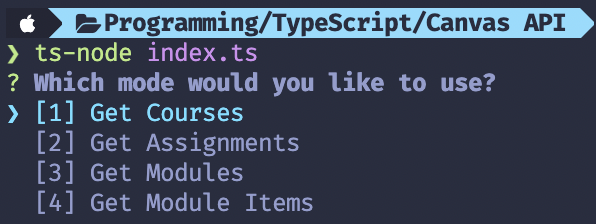

# **Canvas API Scrapper**
> Built using [Node.js](https://nodejs.org/) and the [Canvas API](https://canvas.instructure.com/doc/api/).

## **Installation**
1. Clone the repository
2. Run `npm install` or `yarn`
3. Put your school's Canvas prefix (`https://<PREFIX>.instructure.com`) and your API key in the `.env` file.
   * There is an example `.env` file in the repository called `.env.example`.
4. Run `npm start` or `yarn start`.
5. Select a mode and then enter the arguments if required.
6. Enjoy!

## **Usage**
1. You can view information from Canvas through the command line.
   * You can view the list of courses, assignments, modules, and module info.

## **Image**

